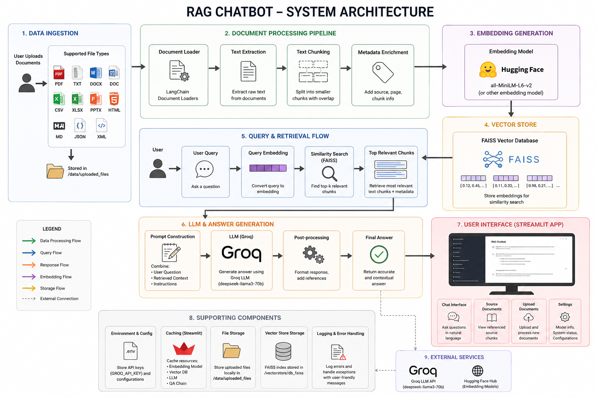
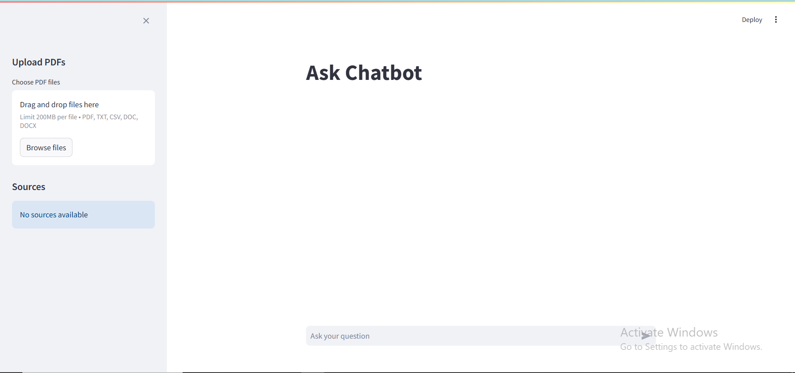
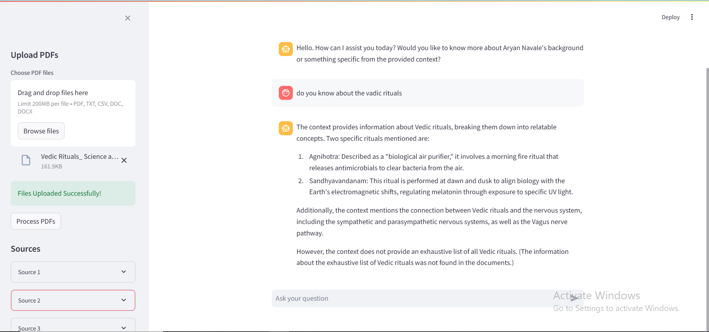

# RAG System - AI Document Chatbot

An AI-powered document assistant that enables users to chat with PDFs, Word files, TXT files, CSVs, and other documents using Retrieval-Augmented Generation (RAG).

The system processes uploaded documents, generates embeddings using Sentence Transformers, stores vectors in a FAISS database, and uses Groq LLMs to generate context-aware answers with source references.

---

# System Architecture



---

# Application Interface Preview

## Chat Interface



## Chat With PDFs



---

# Features

- Chat with documents using AI
- Multi-document support
- Supports PDF, TXT, CSV, DOC, DOCX, and Markdown files
- Semantic search using FAISS
- Groq-powered LLM responses
- Source references for answers
- Dynamic vector database creation
- Streamlit chat interface
- Sidebar document management
- Clean and responsive UI

---

# Tech Stack

| Component | Technology |
|---|---|
| LLM | Groq Llama 3.3 |
| Embeddings | Sentence Transformers |
| Vector Database | FAISS |
| Framework | LangChain |
| Frontend | Streamlit |
| Backend | Python |
| Document Processing | LangChain Loaders / PyMuPDF |

---

# Project Structure

```text
RAG/
│
├── app.py
├── data_pipeline.py
├── generation_pipeline.py
├── loader.py
├── requirements.txt
├── .env
├── README.md
│
├── data/
│   └── uploaded_files/
│
├── vectorstore/
│   └── db_faiss/
│
└── assets/
    ├── system_architecture.png
    ├── ss1.png
    └── ss2.png
```

---

# Supported File Types

- PDF
- TXT
- CSV
- DOC
- DOCX
- Markdown Files

The system can process multiple documents together and create a unified knowledge base for retrieval.

---

# Setup Guide

## 1. Clone Repository

```bash
git clone https://github.com/aryannavale01/RAG-Chatbot.git
cd RAG-Chatbot
```

---

## 2. Create Virtual Environment

```bash
python -m venv .venv
```

---

## 3. Activate Virtual Environment

### Windows

```bash
.venv\Scripts\activate
```

### Linux / macOS

```bash
source .venv/bin/activate
```

---

## 4. Install Dependencies

```bash
pip install -r requirements.txt
```

---

## 5. Configure Environment Variables

Create a `.env` file in the project root:

```env
GROQ_API_KEY=your_api_key_here
```

Get your API key from:

https://console.groq.com

---

## 6. Run the Application

```bash
streamlit run app.py
```

Application runs on:

```text
http://localhost:8501
```

---

# How the System Works

1. User uploads documents
2. Documents are loaded and processed
3. Text is split into chunks
4. Embeddings are generated
5. FAISS stores vector embeddings
6. User submits a query
7. Relevant chunks are retrieved
8. Context is sent to the LLM
9. AI generates the final response
10. Source references are displayed

---

# RAG Pipeline

```text
User Query
    ↓
Embedding Generation
    ↓
FAISS Similarity Search
    ↓
Relevant Chunks Retrieved
    ↓
Context + Prompt Sent to LLM
    ↓
LLM Generates Response
    ↓
Answer + Sources Displayed
```

---

# Streamlit Interface

## Main Chat Area

- User queries
- AI responses
- Chat history

## Sidebar

- File uploader
- Vectorstore processing
- Source document viewer
- Metadata display

---

# Embedding Model

Current model:

```text
sentence-transformers/all-MiniLM-L6-v2
```

### Why This Model?

- Fast inference
- Lightweight
- Good semantic retrieval quality
- Low memory usage

---

# Future Improvements

- Conversation memory
- OCR support for scanned PDFs
- Cloud deployment
- Authentication system
- Hybrid search
- Multi-user support
- Audio transcription
- Document summarization

---

# Performance

| Operation | Speed |
|---|---|
| Vector Search | <200ms |
| LLM Response | ~1–2 seconds |
| Embedding Generation | Fast (GPU optional) |

---

# About

This project demonstrates a production-style RAG pipeline using:

- LangChain
- FAISS
- Streamlit
- Groq
- HuggingFace Embeddings

The system is designed for experimentation, learning, and building AI-powered document assistants.

---

# Author

Aryan Navale
