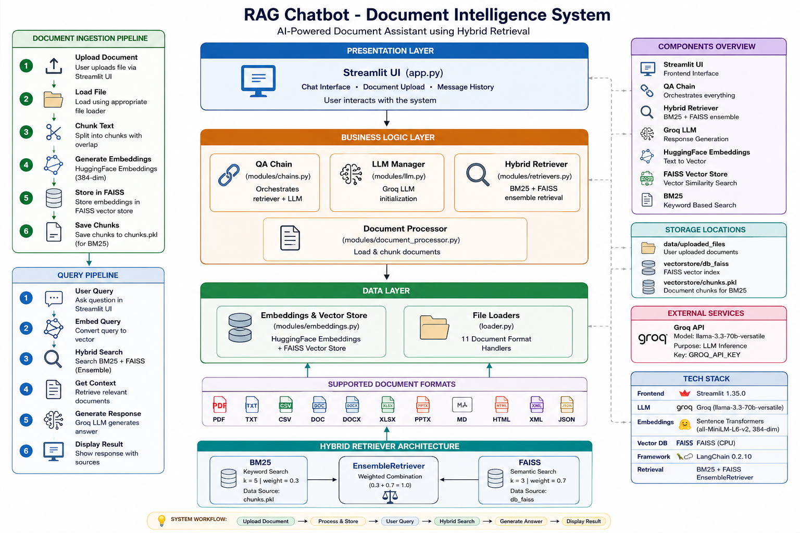
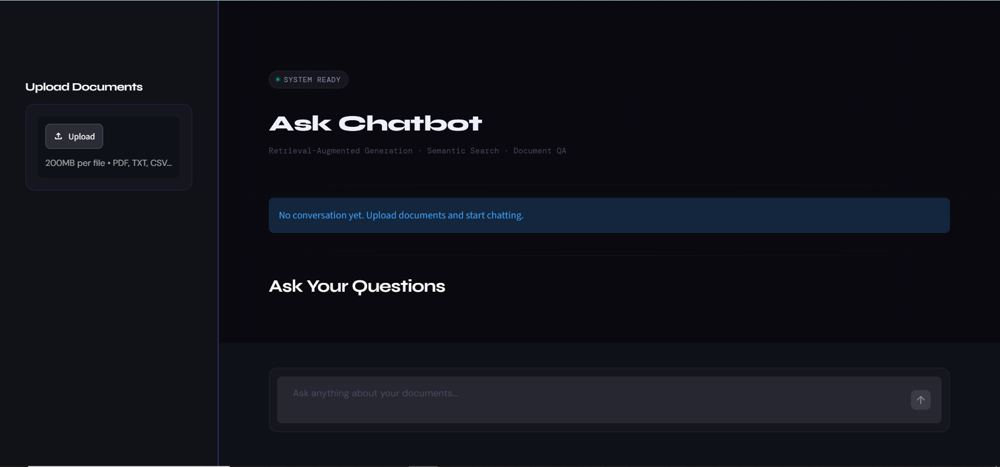
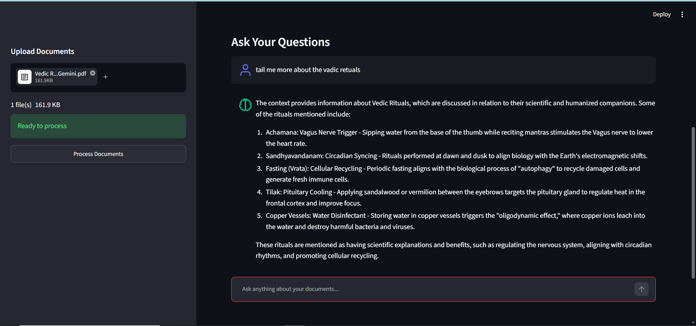
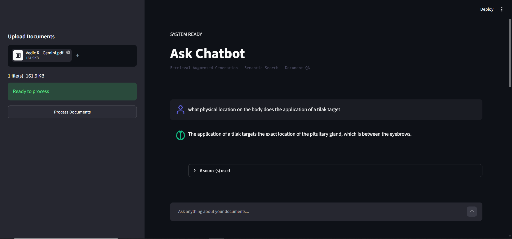
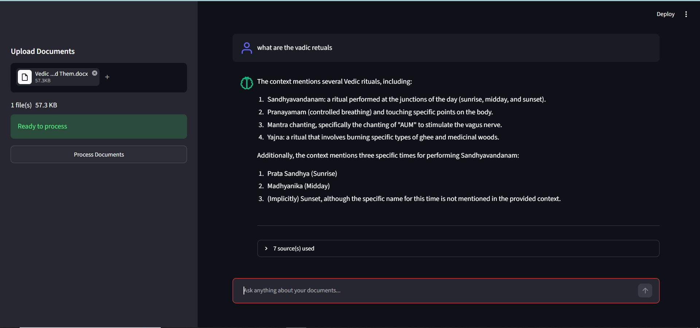

# RAG System - AI Document Chatbot

An AI-powered document assistant that enables users to chat with PDFs, Word files, TXT files, CSVs, and other documents using Retrieval-Augmented Generation (RAG).

The system processes uploaded documents, generates embeddings using Sentence Transformers, stores vectors in a FAISS database, and uses Groq LLMs to generate context-aware answers with source references.

---

# System Architecture



---

# Application Interface Preview

## Main Interface



## Chat Interface



## Q&A Session



## Q&A Continued



---

# Features

- Chat with documents using AI
- Multi-document support
- Supports PDF, TXT, CSV, DOC, DOCX, and Markdown files
- Semantic search using FAISS
- Groq-powered LLM responses
- Source references for answers
- Dynamic vector database creation
- Streamlit chat interface
- Sidebar document management
- Clean and responsive UI

---

# Tech Stack

| Component | Technology |
|---|---|
| LLM | Groq Llama 3.3 |
| Embeddings | Sentence Transformers (384-dim) |
| Vector Database | FAISS |
| Keyword Search | BM25 (Hybrid Retriever) |
| Framework | LangChain |
| Frontend | Streamlit |
| Backend | Python |
| Document Processing | LangChain Loaders / PyMuPDF |

---

# Project Structure

```text
RAG/
│
├── app.py                       # Streamlit UI
├── settings.py                  # Centralized configuration
├── config.py                    # Prompt templates
├── loader.py                    # Document loaders
├── requirements.txt
├── .env
├── .env.example
├── README.md
│
├── modules/                     # Modular components
│   ├── __init__.py
│   ├── llm.py                  # LLM initialization
│   ├── embeddings.py           # Vector store management
│   ├── retrievers.py           # BM25 + Hybrid retriever
│   ├── document_processor.py   # Document chunking/loading
│   └── chains.py               # QA chain orchestration
│
├── data/
│   └── uploaded_files/
│
├── vectorstore/
│   ├── db_faiss/               # FAISS index
│   ├── chunks.pkl              # BM25 chunks persistence
│   └── docs.pkl
│
└── assets/
    ├── new-system-architecture.png
    ├── start.png
    ├── ss.png
    ├── qa.png
    └── qa2.png
```

---

# Supported File Types

- PDF (`.pdf`)
- Text (`.txt`)
- CSV (`.csv`)
- Word Documents (`.doc`, `.docx`)
- Excel (`.xlsx`)
- Markdown (`.md`)
- HTML (`.html`)
- XML (`.xml`)
- JSON (`.json`)
- PowerPoint (`.pptx`)

The system processes multiple documents together and creates a unified knowledge base for retrieval.

---

# Configuration

All settings are stored in `.env` file and managed by `settings.py`:

```env
# LLM Configuration
GROQ_API_KEY=your_key_here
GROQ_MODEL_NAME=llama-3.3-70b-versatile
LLM_TEMPERATURE=0.5
LLM_MAX_TOKENS=2048

# Embedding Configuration
EMBEDDING_MODEL_NAME=sentence-transformers/all-MiniLM-L6-v2

# Retriever Configuration
FAISS_SEARCH_K=3
BM25_SEARCH_K=5
BM25_WEIGHT=0.3
FAISS_WEIGHT=0.7

# Text Processing
CHUNK_SIZE=500
CHUNK_OVERLAP=50

# UI Configuration
STREAMLIT_PAGE_TITLE=RAG Chatbot
DISPLAY_CONTENT_LENGTH=500
MAX_FILE_SIZE_MB=50
```

---

# Setup Guide

## 1. Clone Repository

```bash
git clone https://github.com/aryannavale01/RAG-Chatbot.git
cd RAG-Chatbot
```

---

## 2. Create Virtual Environment

```bash
python -m venv .venv
```

---

## 3. Activate Virtual Environment

### Windows

```bash
.venv\Scripts\activate
```

### Linux / macOS

```bash
source .venv/bin/activate
```

---

## 4. Install Dependencies

```bash
pip install -r requirements.txt
```

---

## 5. Configure Environment Variables

Create a `.env` file in the project root:

```env
GROQ_API_KEY=your_api_key_here
```

Get your API key from:

https://console.groq.com

---

## 6. Run the Application

```bash
streamlit run app.py
```

Application runs on:

```text
http://localhost:8501
```

---

# How the System Works

1. User uploads documents
2. Documents are loaded and processed
3. Text is split into chunks
4. Embeddings are generated
5. FAISS stores vector embeddings
6. User submits a query
7. Relevant chunks are retrieved
8. Context is sent to the LLM
9. AI generates the final response
10. Source references are displayed

---

# RAG Pipeline

```text
User Query
    ↓
Embedding Generation
    ↓
FAISS Similarity Search
    ↓
Relevant Chunks Retrieved
    ↓
Context + Prompt Sent to LLM
    ↓
LLM Generates Response
    ↓
Answer + Sources Displayed
```

---

# Hybrid Retriever: BM25 + FAISS

The system uses a **Hybrid Retriever** combining two complementary search strategies:

## BM25 (Keyword Search)
- **Algorithm**: Best Match 25 (probabilistic ranking)
- **Type**: Sparse retriever
- **Strength**: Excellent for exact keyword matches
- **Configuration**: `k=5` (top 5 results), weight=0.3
- **Use Case**: Finds documents with specific terms or names

## FAISS (Semantic Search)
- **Algorithm**: Similarity search using embeddings
- **Type**: Dense retriever
- **Strength**: Captures semantic meaning and context
- **Configuration**: `k=3` (top 3 results), weight=0.7
- **Use Case**: Understands intent and finds conceptually related content

## How It Works Together

```text
Query
    ├─→ BM25 Search (30% weight)
    │   └─→ Returns 5 keyword-matched documents
    │
    ├─→ FAISS Search (70% weight)
    │   └─→ Returns 3 semantically similar documents
    │
    └─→ EnsembleRetriever
        └─→ Combines & ranks results
        └─→ Returns best matches to LLM
```

## Benefits

- **Comprehensive**: Catches both keyword and semantic matches
- **Balanced**: Configurable weights (0.3/0.7 default)
- **Robust**: Falls back to FAISS if BM25 chunks unavailable
- **Efficient**: FAISS handles large-scale similarity search
- **Flexible**: Easy to adjust weights in `.env`

---

# Streamlit Interface

## Main Chat Area

- User queries
- AI responses
- Chat history

## Sidebar

- File uploader
- Vectorstore processing
- Source document viewer
- Metadata display

---

# Embedding Model

Current model:

```text
sentence-transformers/all-MiniLM-L6-v2
```

### Why This Model?

- Fast inference
- Lightweight
- Good semantic retrieval quality
- Low memory usage

---

# Future Improvements

- Conversation memory
- OCR support for scanned PDFs
- Cloud deployment
- Authentication system
- Hybrid search
- Multi-user support
- Audio transcription
- Document summarization

---

# Performance

| Operation | Speed |
|---|---|
| Vector Search | <200ms |
| LLM Response | ~1–2 seconds |
| Embedding Generation | Fast (GPU optional) |

---

# About

This project demonstrates a production-style RAG pipeline using:

- LangChain
- FAISS
- Streamlit
- Groq
- HuggingFace Embeddings

The system is designed for experimentation, learning, and building AI-powered document assistants.

---

# Author

Aryan Navale
